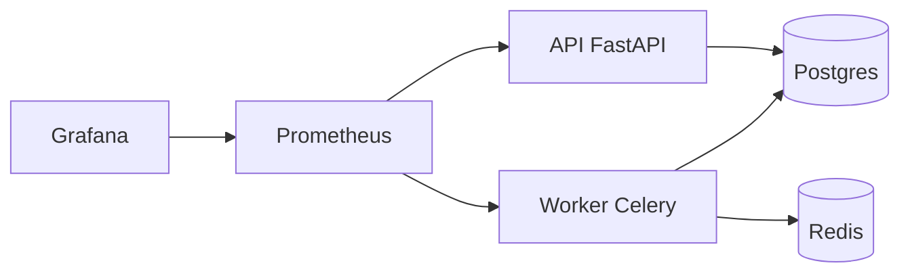

# JobPulse

## Visão geral
JobPulse é uma base de infraestrutura para uma plataforma de scraping e ingestão de vagas. O foco deste setup inicial é confiabilidade, deduplicação, freshness e observabilidade, preparando o terreno para scrapers e pipelines futuros.

## Arquitetura (Mermaid)


## Stack e decisões técnicas
- Python 3.11+
- FastAPI para API HTTP
- Celery + Redis para workers
- Postgres para persistência
- Playwright instalado no worker com Chromium
- Prometheus + Grafana para observabilidade
- Docker + Docker Compose para orquestração local
- Banco via psycopg3: escolha feita por favorecer SQL explícito e previsível no início do projeto, mantendo o schema em `db/schema.sql` e evitando acoplamento prematuro com ORM.

## Como rodar localmente
1) Build e subida dos serviços:

```
docker compose -f infra/docker-compose.yml up --build
```

2) Healthcheck da API:

```
curl -s http://localhost:8000/health
```

3) Prometheus:

```
http://localhost:9090
```

4) Grafana:

```
http://localhost:3000
```

Credenciais padrão do Grafana:
- usuário: `admin`
- senha: `admin`

## O que ainda não está implementado
- Scraping real (HTTP ou Playwright)
- Parsing e extração semântica
- Deduplicação e lógica de negócio
- Persistência de dados pelos agentes de ingestão
- Quality gates e heurísticas de dados
